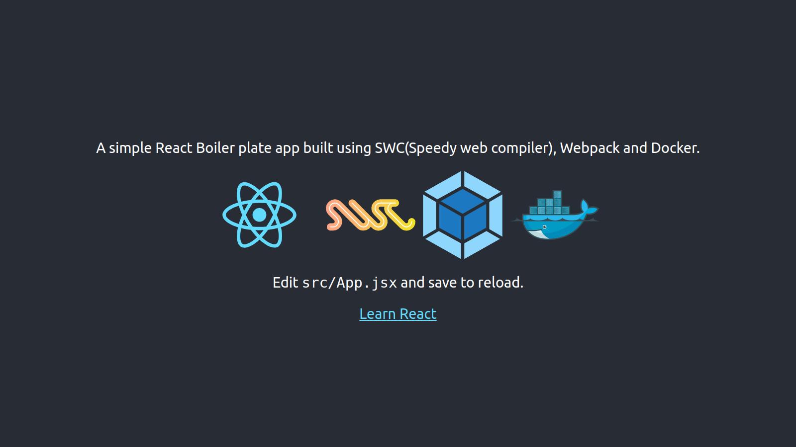

# React App with SWC Compiler and Webpack

This is a React boilerplate created using the SWC compiler and Webpack. The app is containerized with Docker and can be run in both development and production modes.


## Prerequisites

- [Docker](https://docs.docker.com/get-docker/)
- [Docker Compose](https://docs.docker.com/compose/install/)

## Getting Started

1. Clone this repository to your local machine.

   ```bash
    git clone https://github.com/roguedev5/swc-react-boilerplate.git
   ```

2. Create a `.env` file in the root directory of the project.

3. Copy the variables from `.env.example` and paste them into the newly created `.env` file.

### Running in Development Mode

To run the app in development mode, execute the following command:

```bash
docker-compose up
```

The app will be accessible at [http://localhost:4000](http://localhost:4000).

### Running in Production Mode

To run the app in production mode, use the following command:

```bash
docker-compose -f docker-compose-prod.yml up
```

The production-built React app will be available at [http://localhost:7000](http://localhost:7000).

## Additional Notes

- Adjust the `.env` file according to your configuration needs.
- The source code is located in the `src` directory.
- Webpack configurations can be found in the `webpack.config.js` file.
- SWC compiler settings are defined in the `.swcrc` file.
- Feel free to customize the Dockerfiles and configurations to fit your specific requirements.

Happy coding! 🚀
